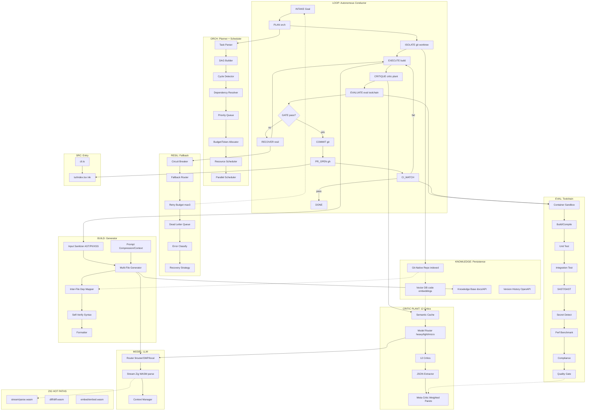

# Zhi (志)

Terminal coding agent dengan **autonomous-loop engine** dan **multi-critic plant** (12 kritikus + meta-aggregator Pareto). Zhi mengambil goal berbahasa alami, merencanakannya sebagai DAG, mengeksekusi di git worktree terpisah, menilai lewat 12 kritikus + toolchain evaluasi, lalu commit + buka PR + pantau CI — berdiri sendiri sampai goal terpenuhi tanpa intervensi manusia di setiap step.

## Mengapa ada Zhi

Tool agent saat ini (Claude Code, OMP, OpenCode, Aider, KiloCode, Hermes) sebagian besar adalah *chat wrapper* dengan tool calls. Perbedaannya tipis. Zhi mengambil sudut tajam yang belum dimenangkan: **loop yang benar-benar menutup siklus dev dengan gate berbasis kode**, bukan cuma generate diff.

Dua pilar kecanggihan:

1. **Autonomous-loop conductor** — state machine `INTAKE → PLAN → ISOLATE → EXECUTE → CRITIQUE → EVALUATE → COMMIT → PR_OPEN → CI_WATCH → DONE`. Setiap transisi dijaga gate yang *machine-decidable* (build hijau, test hijau, lint bersih, secret-scan bersih, quality-gate lolos). Recovery *bounded* (circuit breaker + retry max-3), bukan spin tak terbatas.
2. **Multi-critic plant** — 12 kritikus (Security, Perf, Architecture, Testing, Doc, DevOps, Legal, Privacy, Style, DX, Accessibility, Maintainability) menilai hasil, lalu `aggregate.ts` menghitung *weighted Pareto frontier* untuk memutus layak-commit atau tidak. Keputusan terukur, bukan vibes.

## Arsitektur (ringkas)

## Modul

| Modul | Path | Tanggung jawab |
|---|---|---|
| loop | `engine/loop/` | Conductor state machine; menjahit semua modul | 
| orch | `engine/orch/` | Task parser, DAG builder, cycle detect, budget/token, scheduler | 
| build | `engine/build/` | Multi-file generator, inter-file dep mapper, self-verify, context | 
| critic | `engine/critic/` | 12 kritikus + semantic cache + meta-aggregator Pareto | 
| eval | `engine/eval/` | Sandbox, build/test, SAST/secret, perf, compliance, quality gate | 
| resil | `engine/resil/` | Circuit breaker, retry budget, DLQ, recovery | 
| knowledge | `engine/knowledge/` | Vector DB, git-native index, KB, version history | 
| model | `engine/model/` | Router LLM (9router/OMP/local), stream Zig, context | 
| native | `native/` | Zig→WASM hot path: stream parse, diff, embed | 
| src | `src/` | `cli.ts` entry + `tui/` ink viewer | 

## Status

**Prototype terimplementasi (experimental).** Mayoritas modul engine sudah ada dengan test hijau (`bun test` 96 pass). `engine/orch/` (planner: parseGoal/buildDag/allocate/schedule) dan `engine/loop/` (conductor state machine) sudah nyata; `generate`/`verify`/`compress` (`engine/build`) sudah nyata; `ISOLATE`/`PR_OPEN`/`CI_WATCH` di-wiring via adapter git/gh opsional (`engine/loop/wiring/git.ts`, aktif bila `ZHI_AUTO_PR=1`) — lihat ADR-005. Mode offline (default) tanpa `ciWatch` → CI dianggap green (aman untuk test/smoke).

## Cara baca docs

1. `docs/ARCHITECTURE.md` — sistem penuh, alur data, feedback loop, native hot path.
2. `docs/design/*.md` — spesifikasi per modul (interface, alur, edge case, v1 vs later).
3. `docs/adr/*.md` — keputusan arsitektur (ADR) yang tidak bisa dibalik mudah.
4. `AGENTS.md` + `AGENTS.Style.md` — konvensi layer & standar dokumentasi (Doxygen Universal).
5. `EXPLAIN-CHANGES.md` — format changelog per perubahan.

## Konvensi singkat

- Root berbasis **layer**, bukan domain (`engine/`, `src/`, `native/` sebagai sibling).
- **Atomic nesting**: ≤4 file per folder, ≤200 SLOC per file, vertikal over horizontal.
- Bahasa: TS (engine types/edge), JS (glue self-register), Zig→WASM (hot path). Runtime **Bun** (eksekusi `.ts`/`.js` native).
- Doc standard: `@AGENTS.Style.md` (Doxygen Universal).

## Yang sengaja di-drop (YAGNI)

Dari sketsa awal, **Top Layer gateway** (Web/API/Rate Limiter/Token Auth) dan **Monitoring layer** penuh (tracing/perf analytics dashboard) dibuang. Zhi adalah CLI lokal single-user: cukup input validation + sanitasi di trust boundary, dan logging + cost log ringan (fold ke `knowledge/store.ts`).

## Lisensi

Zhi dirilis di bawah **MIT License**. Lihat `LICENSE`. Repositori saat ini private; lisensi berlaku saat diakses publik.
