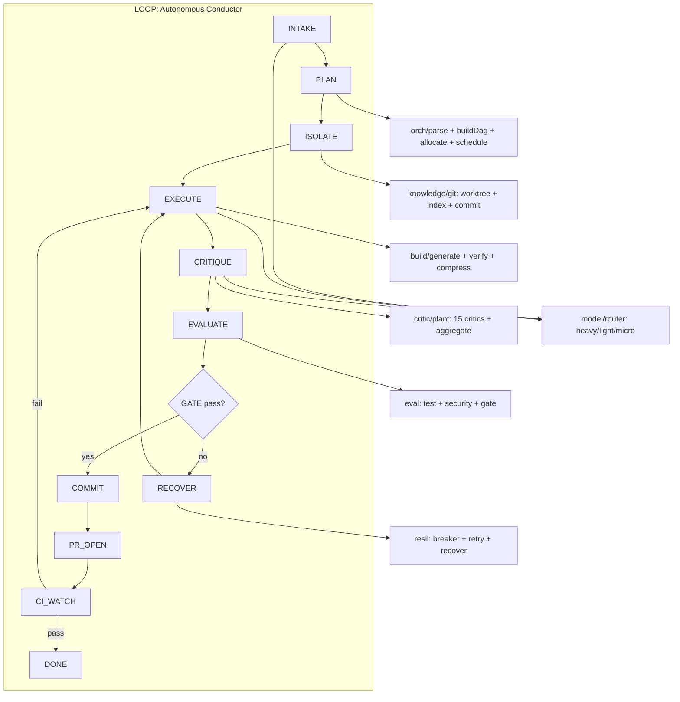

<p align="center">
  
</p>

<p align="center">
  <a href="https://github.com/miruamel/zhi/actions"></a>
  <a href="LICENSE"></a>
  
  <a href="https://bun.sh"></a>
  
  <a href="https://www.npmjs.com/package/@miruamel/zhi"></a>
  <a href="https://github.com/miruamel/zhi/stargazers"></a>
</p>

<p align="center">
  
</p>

# Zhi (志) — Autonomous Coding Agent

> **Goal in, PR out.** A terminal coding agent with a code-grounded gate: 15-critic weighted Pareto + real toolchain (build, test, secret-scan). Bun-native + Zig WASM. MIT.

---

## Why Zhi exists

Today's agent tools (Claude Code, OMP, OpenCode, Aider, KiloCode, Hermes) are mostly chat wrappers with tool calls. The differences are thin. Zhi takes a sharp angle that hasn't been won: **a loop that actually closes the dev cycle with code-grounded gates**, not just emitting a diff.

**Two pillars of sophistication:**

1. **Autonomous-loop conductor** — a state machine `INTAKE → PLAN → ISOLATE → EXECUTE → CRITIQUE → EVALUATE → COMMIT → PR_OPEN → CI_WATCH → DONE`. Every transition is guarded by a machine-decidable gate (build green, tests green, lint clean, secret-scan clean, quality-gate pass). Recovery is **bounded** (circuit breaker + retry max-3), never an open-ended spin.
2. **Multi-critic plant** — 15 critics (Security, Perf, Architecture, Testing, Doc, DevOps, Legal, Privacy, Style, DX, Accessibility, Maintainability, SLOC, Imports, Todo) score the result, then `aggregate.ts` computes a **weighted Pareto frontier** to decide commit-readiness. Decisions are measured, not vibes.

---

## Quickstart

```bash
bun install
bun test                   # run the entire test suite
bun run cli "<goal>"       # one loop cycle (offline, no PR)
bun run cli critique:repo  # audit repo hygiene (DevOps/Legal/DX/Testing)
bun run arch:check         # guard architecture (circular / illegal layer edge)
```

---

## Architecture (overview)



---

## Modules

| Module    | Path                | Responsibility                                                       |
| --------- | ------------------- | -------------------------------------------------------------------- |
| loop      | `engine/loop/`      | Conductor state machine, gate, observability metrics, recover wiring |
| orch      | `engine/orch/`      | Goal parser, DAG builder, cycle detect, token allocator, scheduler   |
| build     | `engine/build/`     | Multi-file generator, inter-file dep mapper, self-verify, context    |
| critic    | `engine/critic/`    | 15 critics, semantic cache, meta-aggregator Pareto                   |
| eval      | `engine/eval/`      | Sandbox, test, SAST/secret, perf, compliance, quality gate           |
| resil     | `engine/resil/`     | Circuit breaker, retry budget, DLQ, recovery                         |
| knowledge | `engine/knowledge/` | Vector store, git-native index, ledger, KB                           |
| model     | `engine/model/`     | LLM router (9router/OMP/local), Zig stream parse, context            |
| native    | `native/`           | Zig→WASM hot path: stream parse, diff, embed                         |
| src       | `src/`              | `cli.ts` entry + `tui/` ink viewer                                   |

---

## Status

**Prototype implemented (experimental).** Most engine modules exist with green tests (`bun test` 229 pass). `engine/orch/` (planner: `parseGoal`/`buildDag`/`allocate`/`schedule`) and `engine/loop/` (conductor state machine) are real; `generate`/`verify`/`compress` (`engine/build`) are real; `ISOLATE`/`PR_OPEN`/`CI_WATCH` are wired via an optional git/gh adapter (`engine/loop/wiring/git.ts`, active when `ZHI_AUTO_PR=1`) — see ADR-005. Offline mode (default) without `ciWatch` → CI is assumed green (safe for test/smoke).

**Gate status (latest run):**

| Gate         | Status                                                 |
| ------------ | ------------------------------------------------------ |
| typecheck    | ✅ 0 errors                                            |
| lint         | ✅ 0 errors (131 JSDoc warnings = baseline)            |
| format:check | ✅ clean                                               |
| test         | ✅ 229 pass / 0 fail                                   |
| arch:check   | ✅ 0 circular / 0 deep-relative / 0 illegal layer edge |

---

## How to read the docs

1. **[`docs/ARCHITECTURE.md`](docs/ARCHITECTURE.md)** — full system, data flow, feedback loop, native hot path.
2. **[`docs/design/*.md`](docs/design/)** — per-module spec (interface, flow, edge cases, v1 vs later).
3. **[`docs/adr/*.md`](docs/adr/)** — architectural decisions that are not easily reversible.
4. **[`AGENTS.md`](AGENTS.md)** + **[`AGENTS.Style.md`](AGENTS.Style.md)** — layer convention + doc standard (Doxygen Universal).
5. **[`CHANGES.md`](CHANGES.md)** — changelog per change (Keep a Changelog + SemVer; historical archive at [`docs/archive/EXPLAIN-CHANGES.md`](docs/archive/EXPLAIN-CHANGES.md)).
6. **[`BUSINESS.md`](BUSINESS.md)** — positioning, ICP, pricing, competitive landscape.
7. **[`docs/marketing/`](docs/marketing/)** — landing page copy, social bios, use cases, repo metadata checklist.
8. **[`SECURITY.md`](SECURITY.md)** — security policy + private vulnerability reporting.

---

## Conventions (short)

- Root is **layer-first**, not domain (`engine/`, `src/`, `native/` as siblings).
- **Atomic nesting**: ≤4 files per folder, ≤200 SLOC per file, vertical over horizontal.
- Languages: TS (engine types/edge), JS (self-registering glue), Zig→WASM (hot path). Runtime is **Bun** (runs `.ts`/`.js` natively).
- Doc standard: [`AGENTS.Style.md`](AGENTS.Style.md) (Doxygen Universal).
- Brand assets: [`assets/`](assets/) (favicon, logo, OG banner, doc header, glyphs, ASCII splash). See [`assets/README.md`](assets/README.md).

---

## Deliberately dropped (YAGNI)

From the early sketch, the **Top Layer gateway** (Web/API/Rate Limiter/Token Auth) and a full **Monitoring layer** (tracing/perf analytics dashboard) are cut. Zhi is a local single-user CLI: input validation + sanitisation at the trust boundary is enough, and logging + a light cost log fold into `knowledge/store.ts`.

---

## License

Zhi is released under the **MIT License**. See [`LICENSE`](LICENSE). The repository is currently private; the licence applies once it's publicly accessible.

---

<p align="center">
  <sub>Built with Bun + Zig + Doxygen Universal + 15 critics who never sleep.</sub>
</p>
