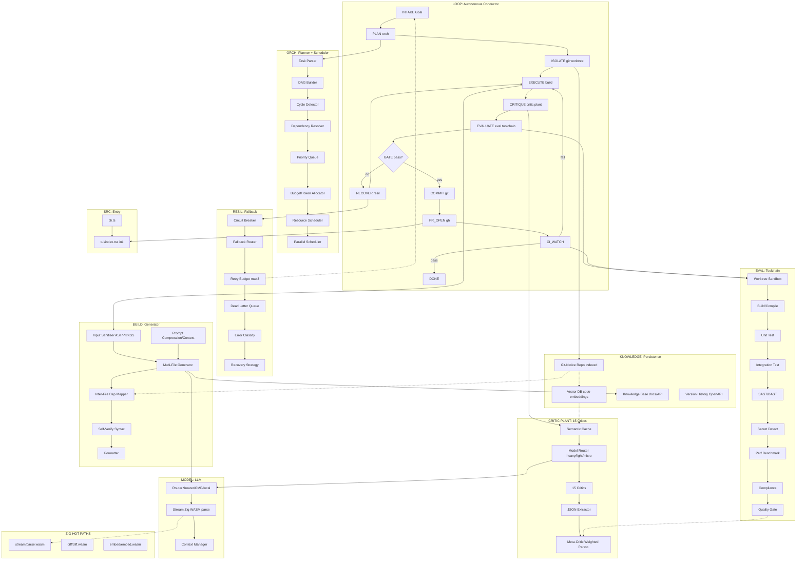

# Zhi (志)

[](https://github.com/miruamel/zhi/actions)
[](LICENSE)
[](package.json)
[](https://bun.sh)
[](https://nodejs.org)

A terminal coding agent with an **autonomous-loop engine** and a **multi-critic plant** (15 critics + meta-aggregator Pareto). Zhi takes a natural-language goal, plans it as a DAG, executes it in an isolated git worktree, evaluates through 15 critics and a toolchain, then commits + opens a PR + watches CI — standing on its own until the goal is met without human intervention at every step.

## Why Zhi exists

Today's agent tools (Claude Code, OMP, OpenCode, Aider, KiloCode, Hermes) are mostly chat wrappers with tool calls. The differences are thin. Zhi takes a sharp angle that hasn't been won: **a loop that actually closes the dev cycle with code-grounded gates**, not just emitting a diff.

Two pillars of sophistication:

1. **Autonomous-loop conductor** — a state machine `INTAKE → PLAN → ISOLATE → EXECUTE → CRITIQUE → EVALUATE → COMMIT → PR_OPEN → CI_WATCH → DONE`. Every transition is guarded by a machine-decidable gate (build green, tests green, lint clean, secret-scan clean, quality-gate pass). Recovery is **bounded** (circuit breaker + retry max-3), not an open-ended spin.
2. **Multi-critic plant** — 15 critics (Security, Perf, Architecture, Testing, Doc, DevOps, Legal, Privacy, Style, DX, Accessibility, Maintainability, SLOC, Imports, Todo) score the result, then `aggregate.ts` computes a **weighted Pareto frontier** to decide commit-readiness. Decisions are measured, not vibes.

## Quickstart

```bash
bun install
bun test                   # run the entire test suite
bun run cli "<goal>"       # one loop cycle (offline, no PR)
bun run cli critique:repo  # audit repo hygiene (DevOps/Legal/DX/Testing)
bun run arch:check         # guard architecture (circular / illegal layer edge)
```

## Architecture (overview)



## Modules

| Module     | Path                  | Responsibility                                                    |
| ---------- | --------------------- | ----------------------------------------------------------------- |
| loop       | `engine/loop/`        | Conductor state machine; stitches all modules                    |
| orch       | `engine/orch/`        | Task parser, DAG builder, cycle detect, budget/token, scheduler   |
| build      | `engine/build/`       | Multi-file generator, inter-file dep mapper, self-verify, context |
| critic     | `engine/critic/`      | 15 critics + semantic cache + meta-aggregator Pareto             |
| eval       | `engine/eval/`        | Sandbox, build/test, SAST/secret, perf, compliance, quality gate  |
| resil      | `engine/resil/`       | Circuit breaker, retry budget, DLQ, recovery                      |
| knowledge  | `engine/knowledge/`   | Vector DB, git-native index, KB, version history                  |
| model      | `engine/model/`       | LLM router (9router/OMP/local), Zig stream parse, context         |
| native     | `native/`             | Zig→WASM hot path: stream parse, diff, embed                      |
| src        | `src/`                | `cli.ts` entry + `tui/` ink viewer                                |

## Status

**Prototype implemented (experimental).** Most engine modules exist with green tests (`bun test` 221 pass). `engine/orch/` (planner: `parseGoal`/`buildDag`/`allocate`/`schedule`) and `engine/loop/` (conductor state machine) are real; `generate`/`verify`/`compress` (`engine/build`) are real; `ISOLATE`/`PR_OPEN`/`CI_WATCH` are wired via an optional git/gh adapter (`engine/loop/wiring/git.ts`, active when `ZHI_AUTO_PR=1`) — see ADR-005. Offline mode (default) without `ciWatch` → CI is assumed green (safe for test/smoke).

## How to read the docs

1. `docs/ARCHITECTURE.md` — full system, data flow, feedback loop, native hot path.
2. `docs/design/*.md` — per-module spec (interface, flow, edge cases, v1 vs later).
3. `docs/adr/*.md` — architectural decisions that are not easily reversible.
4. `AGENTS.md` + `AGENTS.Style.md` — layer convention + doc standard (Doxygen Universal).
5. `CHANGES.md` — changelog per change (Keep a Changelog + SemVer; historical archive at `docs/archive/EXPLAIN-CHANGES.md`).

## Conventions (short)

- Root is **layer-first**, not domain (`engine/`, `src/`, `native/` as siblings).
- **Atomic nesting**: ≤4 files per folder, ≤200 SLOC per file, vertical over horizontal.
- Languages: TS (engine types/edge), JS (self-registering glue), Zig→WASM (hot path). Runtime is **Bun** (runs `.ts`/`.js` natively).
- Doc standard: `@AGENTS.Style.md` (Doxygen Universal).
- Brand assets: `assets/` (favicon, logo, OG banner, ASCII splash). See `assets/README.md`.

## Deliberately dropped (YAGNI)

From the early sketch, the **Top Layer gateway** (Web/API/Rate Limiter/Token Auth) and a full **Monitoring layer** (tracing/perf analytics dashboard) are cut. Zhi is a local single-user CLI: input validation + sanitisation at the trust boundary is enough, and logging + a light cost log fold into `knowledge/store.ts`.

## License

Zhi is released under the **MIT License**. See `LICENSE`. The repository is currently private; the licence applies once it's publicly accessible.
