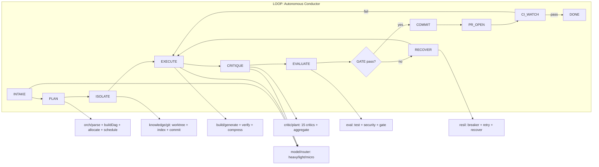
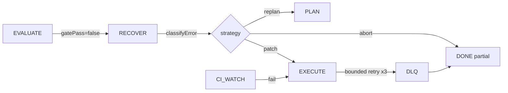

# ARCHITECTURE.md

<p align="center">  </p>
<p align="center">  </p>

System overview of Zhi: data flow, feedback loop, native hot path, and module boundaries.

## 1. Why

Zhi is a terminal coding agent with an autonomous loop. Existing agent tools (Claude Code, OMP, OpenCode, Aider, KiloCode, Hermes) are mostly chat wrappers with tool calls. The interesting move is to **close the dev cycle with code-grounded gates**, not just emit a diff.

Two pillars:

1. **Autonomous-loop conductor** — state machine `INTAKE → PLAN → ISOLATE → EXECUTE → CRITIQUE → EVALUATE → COMMIT → PR_OPEN → CI_WATCH → DONE`. Every transition is guarded by a machine-decidable gate (build green, test green, lint clean, secret-scan clean, quality-gate pass). Recovery is bounded (circuit breaker + retry max-3), never an open-ended spin.
2. **Multi-critic plant** — 15 critics (Security, Perf, Architecture, Testing, Doc, DevOps, Legal, Privacy, Style, DX, Accessibility, Maintainability, SLOC, Imports, Todo) score the result, then `aggregate.ts` computes a weighted Pareto frontier to decide commit-readiness. Decisions are measured, not vibes.

## 2. High-level diagram



## 3. Data flow (one step)

```
Goal (text)
  -> parseGoal()         -> Intent
  -> buildDag()          -> Dag (nodes, edges, topo)
  -> allocate(budget)    -> Map<stepId, tokens>
  -> schedule()          -> Step[] in execution order
  -> per step:
       build/generate(spec, invoker?)         -> FileChange[]
       build/verify(changes)                  -> VerifyResult
       critic/plant/composeCritiques(changes)  -> Critique[]
       critic/aggregate(critiques, threshold)  -> Aggregate (pass?, weightedAvg)
       eval/evaluate(worktree)                -> EvalReport (gatePass?)
       gatePass(state) -> COMMIT | RECOVER
  -> commit(worktree)    -> branch
  -> prOpen(branch)      -> PR url
  -> ciWatch(runId)      -> 'pass' | 'fail'
  -> DONE | DONE(partial) + report
```

## 4. Feedback loop



Critic and eval outcomes are both part of the gate. `gatePass` = `critic.aggregate.pass ∧ eval.evaluate.gatePass`.

## 5. Native hot path (Zig → WASM)

Three CPU-bound lanes are implemented as Zig modules compiled to WASM and called from TS via thin `engine/<area>/zigBridge.ts`:

- `native/stream/parse.zig` — SSE chunk → `Token[]` + tool-call extract. `engine/stream/zigBridge.ts` exposes `parseStream`.
- `native/diff/diff.zig` — unified diff compute (deferred; future critic lane).
- `native/embed/embed.zig` — code embedding for Vector DB (deferred; needs embedding model).

Decision: **WASM first, N-API only if FFI overhead proves meaningful** (see `docs/adr/ADR-004-native-boundary.md`).

A TS-only fallback parser lives in `engine/stream/parseSseTs.ts` and is auto-selected when the Zig WASM write barrier trips (e.g. proot env).

## 6. Module responsibilities

| Module    | Path                | Owns                                                                 |
| --------- | ------------------- | -------------------------------------------------------------------- |
| loop      | `engine/loop/`      | Conductor state machine, gate, observability metrics, recover wiring |
| orch      | `engine/orch/`      | Goal parser, DAG builder, cycle detect, token allocator, scheduler   |
| build     | `engine/build/`     | Multi-file generator, inter-file dep mapper, self-verify, context    |
| critic    | `engine/critic/`    | 15 critics, semantic cache, meta-aggregator Pareto                   |
| eval      | `engine/eval/`      | Sandbox, test, SAST/secret, perf, compliance, quality gate           |
| resil     | `engine/resil/`     | Circuit breaker, retry budget, DLQ, recovery                         |
| knowledge | `engine/knowledge/` | Vector store, git-native index, ledger, KB                           |
| model     | `engine/model/`     | LLM router (9router/OMP/local), Zig stream parse, context            |
| native    | `native/`           | Zig→WASM hot path: stream parse, diff, embed                         |
| src       | `src/`              | `cli.ts` entry + `tui/` ink viewer                                   |

## 7. State machine

States: `INTAKE | PLAN | ISOLATE | EXECUTE | CRITIQUE | EVALUATE | RECOVER | COMMIT | PR_OPEN | CI_WATCH | DONE`.

Transitions:

- `INTAKE → PLAN`
- `PLAN → ISOLATE`
- `ISOLATE → EXECUTE`
- `EXECUTE → CRITIQUE`
- `CRITIQUE → EVALUATE`
- `EVALUATE → COMMIT` (when `gatePass`) | `EVALUATE → RECOVER` (when fail)
- `RECOVER → EXECUTE` (bounded retry)
- `COMMIT → PR_OPEN`
- `PR_OPEN → CI_WATCH`
- `CI_WATCH → RECOVER` (CI red, bounded) | `CI_WATCH → DONE` (CI green)
- budget exhausted anywhere → `RECOVER` → `DONE(PARTIAL)` + report

## 8. v1 scope

End-to-end single-step happy path + bounded recovery:

- `loop` (state machine + pipeline + `gatePass` + recover wiring).
- `orch` (parse, dag, cycle, budget, serial scheduler).
- `build` (generate + verify + context; sanitise is a stub).
- `critic` (cache + Security/Perf/Testing/Style + 11 more concrete + aggregate).
- `eval` (test + security + gate; sandbox = worktree).
- `resil` (breaker + retry max-3 + DLQ + recover).
- `knowledge` (git worktree + index + commit + ledger; vectors graduated, docs/versions stubs).
- `model` (router 9router/OMP/local + stream Zig WASM).
- `native/stream/parse.wasm` (Zig).
- `src/cli/` + `src/tui/` (ink, thin viewer).
- Testing: unit + integration loop + e2e dummy repo.

**Out of scope for v1** (deliberate YAGNI): top-layer gateway (Web/API/rate limit/token auth), full monitoring layer (tracing/perf dashboard). Zhi is a local single-user CLI: trust-boundary input validation + sanitisation is enough, and logging + light cost log fold into `knowledge/store.ts`.

## 9. How to read the docs

1. `docs/ARCHITECTURE.md` (this file) — full system, data flow, feedback loop, native hot path.
2. `docs/design/*.md` — per-module spec (interface, flow, edge cases, v1 vs later).
3. `docs/adr/*.md` — architectural decisions that are not easily reversible.
4. `AGENTS.md` + `AGENTS.Style.md` — layer convention + doc standard (Doxygen Universal).
5. `CHANGES.md` — changelog per change (Keep a Changelog + SemVer; historical archive at `docs/archive/EXPLAIN-CHANGES.md`).
