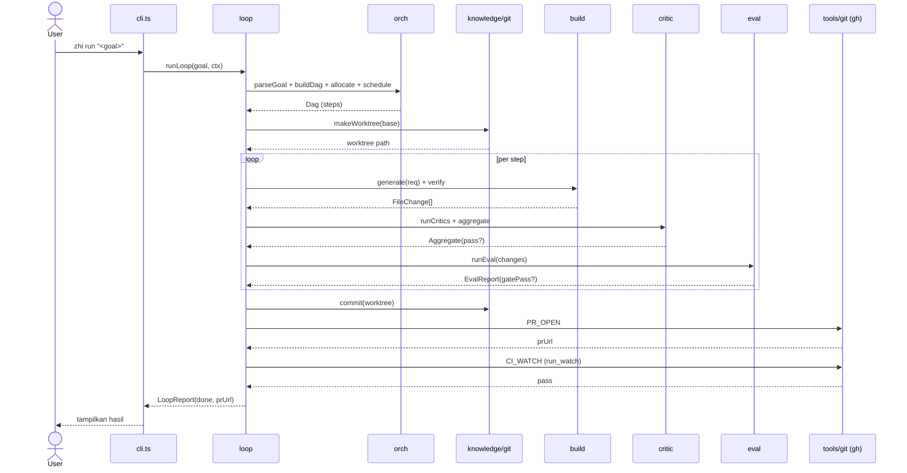
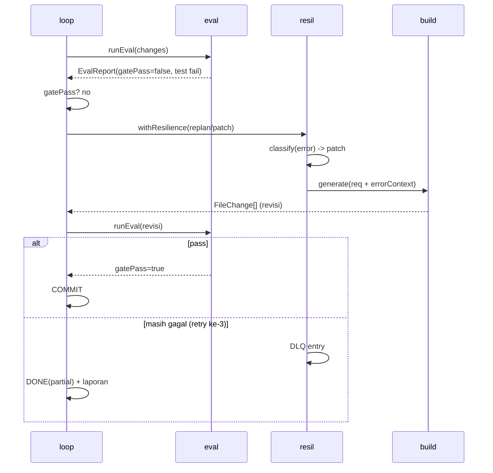
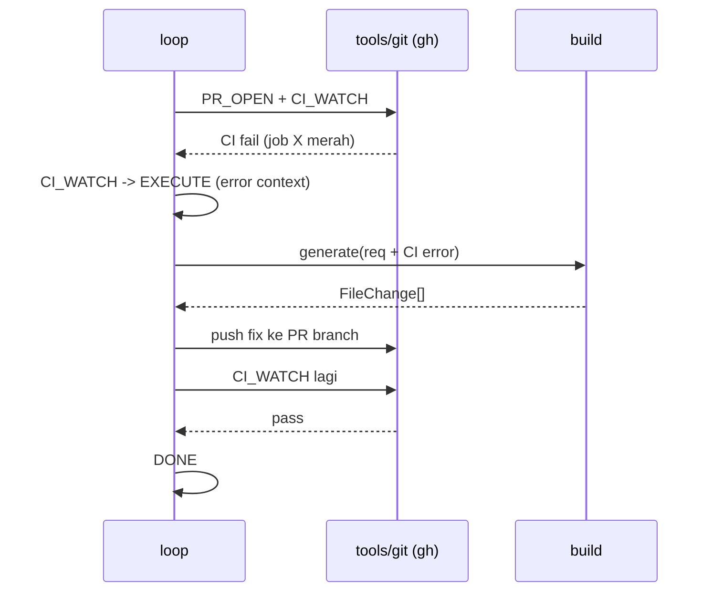

# design/sequences.md — Sequence Diagrams

Visualisasi alur temporal lintas modul. Melengkapi state machine di `loop.md` dan alur di `ARCHITECTURE.md` §3.

## 1. Happy path (goal → PR)

## 2. Recovery pada test gagal

## 3. CI-watch fail loop

## 4. Critic eval (cache-aware)

## Catatan

- Semua diagram asumsikan `loop` sebagai conductor; modul lain stateless terhadap loop (dipanggil, mengembalikan nilai).
- Retry/DLQ diabstraksi ke `resil` — lihat `design/resil.md`.
- Sequence #2 dan #3 adalah satu-satunya jalur yang memicu `RECOVER`/`EXECUTE` ulang; keduanya **bounded** (max-3 via `resil/retry.ts`).
