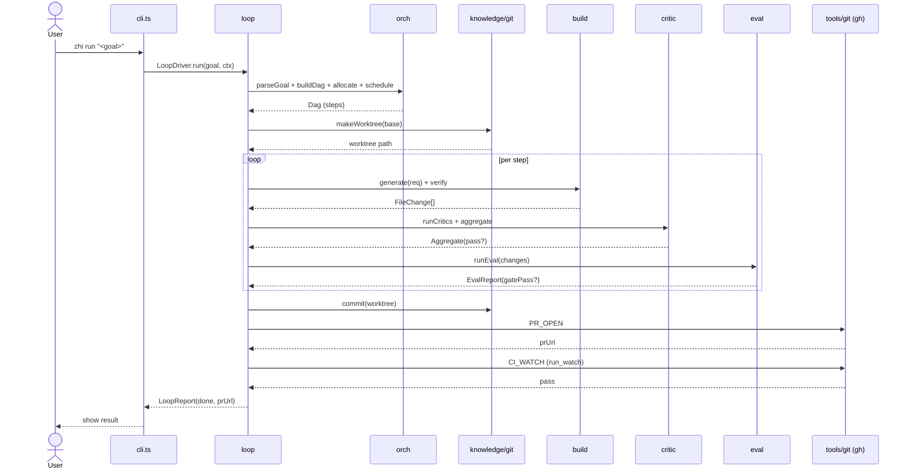
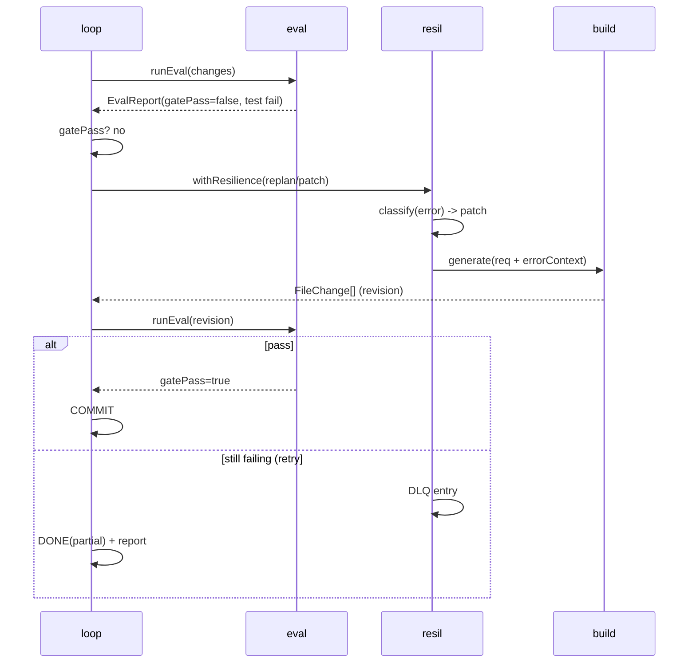
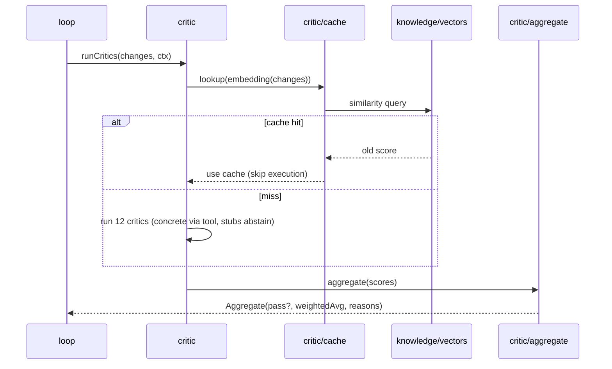

# design/sequences.md — Sequence Diagrams

  

  

Visualisations of cross-module temporal flow. Complements the state machine in `loop.md` and the data flow in `ARCHITECTURE.md` §3.

## 1. Happy path (goal → PR)

## 2. Recovery on test failure

## 3. CI-watch fail loop

## 4. Critic eval (cache-aware)

## Notes

- All diagrams assume `loop` is the conductor; other modules are stateless with respect to the loop (called, return values).
- Retry / DLQ are abstracted into `resil` — see `design/resil.md`.
- Sequence #2 and #3 are the only paths that trigger `RECOVER`/`EXECUTE` again; both are **bounded** (max-3 via `resil/retry.ts`).
