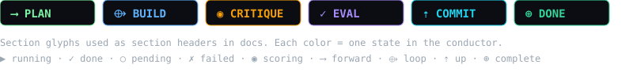

# docs/marketing/

  

  

Business-facing content for Zhi. Source-of-truth for landing-page copy, social bios, use cases, and the repo metadata checklist.

| File                | Purpose                                                                | Audience                     |
| ------------------- | ---------------------------------------------------------------------- | ---------------------------- |
| `landing-copy.md`   | Hero, problem, how-it-works, features, FAQ, footer                      | Marketing site (zhi.dev)    |
| `social-bio.md`     | One-liners for GitHub / X / LinkedIn / npm / dev.to                    | Social media                 |
| `use-cases.md`      | 8 concrete user stories (Sarah, Alex, Mei, Jordan, …)                   | Sales, blog posts, README    |
| `repo-metadata.md`  | Checklist of "small forgotten details": description, topics, releases  | Maintainer / release manager |
| `../BUSINESS.md`    | Positioning, ICP, pricing, competitive landscape, value prop canvas   | Strategy / GTM               |

## Style

- **Bilingual**: English primary, Indonesian secondary.
- **Tone**: technical-but-human, no marketing fluff.
- **Numbers**: always concrete (`15 critics`, `max 3 retries`, `Bun ≥ 1.4.0`).
- **No fake case studies**: every use case is a *pattern*, not a fake testimonial.
- **YAGNI**: don't write a "Team" pricing tier if it doesn't exist yet. Mark it `(planned)`.

## When to update

- When a new critic graduates (e.g. v0.3.0 semantic cache) → update `landing-copy.md` features.
- When a new release ships → update `repo-metadata.md` "v0.x.0 draft".
- When a new competitor launches → update `BUSINESS.md` competitive table.
- When the ICP shifts (e.g. enterprise asks for SSO) → update `BUSINESS.md` ICP + use-cases.

## What NOT to put here

- Code-level design decisions → `docs/design/`
- ADRs → `docs/adr/`
- Test plans → `docs/guides/testing.md`
